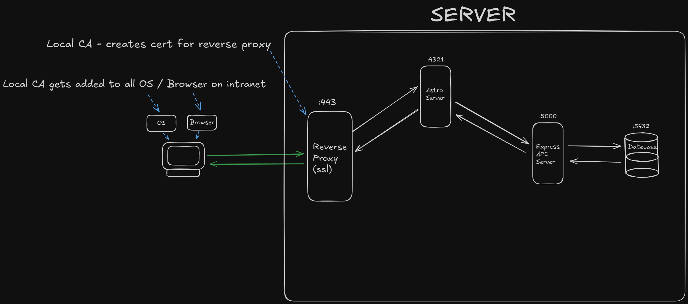

# Basic Reverse Proxy Setup

The idea is to have all traffic on ports 80 and 443 be routed to an Astro project.

Caddy can redirect http traffic (80) to https (443)

Caddy will handle the ssl certificate creating a secure connection to the client.

